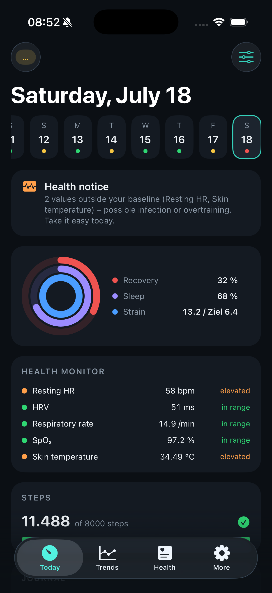
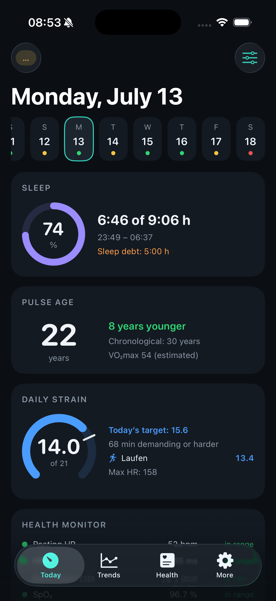
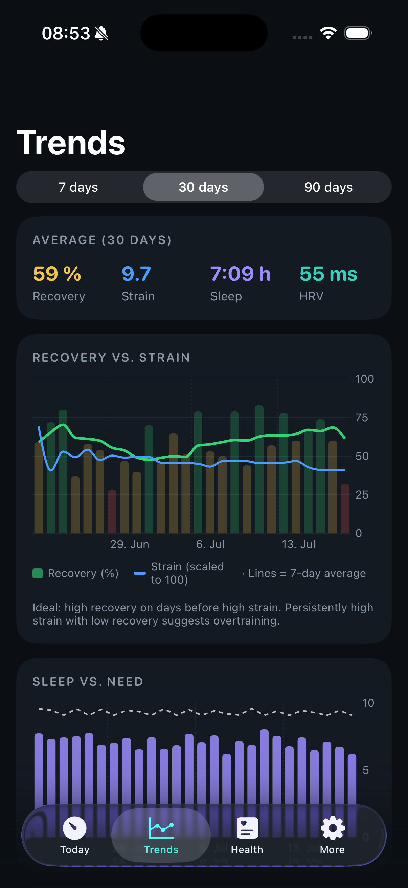
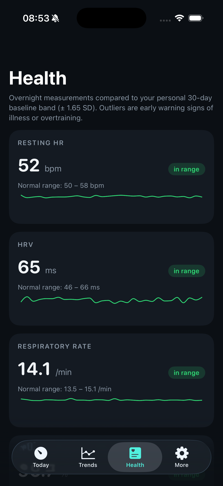
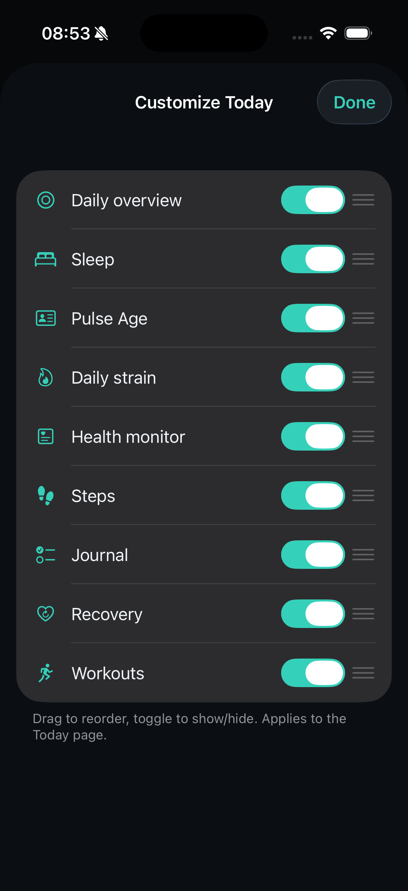

# Pulse — an open-source, Whoop-style readiness tracker for the Fitbit Air

Pulse is a private iOS app that reads your **Google Fitbit Air** data through the
new **Google Health API** and turns it into daily readiness metrics — recovery,
strain, sleep and a biological "Pulse Age". Everything is computed on device
against your own baseline. No server, no subscription, no tracking.

> **Not affiliated with WHOOP, Google or Fitbit.** "Whoop-style" describes the
> *kind* of metrics (recovery / strain / sleep readiness); it does not imply any
> connection. See [Disclaimer](#disclaimer). Licensed under **Apache-2.0**.

<p align="center">
  
  
  
  
  
</p>

<p align="center"><sub>Today · Pulse Age & strain · Trends · Health monitor · Customizable layout — English & German, light/dark.</sub></p>

## What it does

- **Recovery score (1–99 %)** — from HRV, resting heart rate, sleep performance and
  respiration, each scored against your personal 30-day baseline.
- **Strain (0–21)** — cardiovascular daily load from heart-rate-reserve zones on a
  logarithmic scale (Whoop-style), including strain per workout.
- **Sleep** — need, debt, performance, consistency and efficiency, with a phase
  hypnogram.
- **Health Monitor** — resting HR, HRV, respiration, SpO₂ and skin temperature shown
  inside your personal baseline band (± 1.65 SD) with a warning status.
- **Pulse Age** — a biological age estimate from VO₂max, HRV, resting HR, sleep and
  activity, mapped against sex- and age-specific reference norms (calibrates over ~30
  days).
- **Trends** — recovery vs. strain, sleep, HRV and resting HR over 7 / 30 / 90 days.

All data stays **local on the iPhone** (JSON in Application Support). No account on
any server, no analytics.

## Why the Google Health API (not the Fitbit Web API)?

The classic **Fitbit Web API is being shut down in September 2026**. Google is
replacing it with the **Google Health API** (`health.googleapis.com/v4`, OAuth 2.0).
The Fitbit Air already syncs into the **Google Health app**, so Pulse is built
directly against the new API. Because it is new (v4, launched May 2026) and not every
field name is finalized, Pulse decodes **tolerantly** (candidate keys, read-variant
fallback) and logs every metric individually in an in-app **sync log** — a single
missing data type never blocks the rest.

## How the scores are built (in short)

- **Recovery** weights HRV 40 % · resting HR 25 % · sleep 25 % · respiration 10 %,
  each as a z-score vs. your 30-day baseline through a logistic curve; zones follow
  Whoop (≥ 67 green, 34–66 yellow, < 34 red). Missing components are re-weighted.
- **Strain** integrates time in heart-rate-reserve zones (Karvonen) and maps it
  logarithmically to 0–21.
- **Pulse Age** is anchored on VO₂max — the strongest single predictor of all-cause
  mortality (Mandsager, *JAMA Netw Open* 2018) — translated to an age via the FRIEND
  reference norms, blended with an HRV-based age and small capped corrections. It is
  an orientation, not a medical result.

The full methodology, sources and the Google Health data-type mapping live in
[`README.de.md`](README.de.md).

## Build it

Requirements: an iPhone on iOS 17+ with the Google Health app (Fitbit Air paired),
Xcode 16+, and `xcodegen` (`brew install xcodegen`).

```bash
open Pulse.xcodeproj      # NOT the folder or Package.swift — pick the "Pulse" scheme
```

In Xcode: target **Pulse** → *Signing & Capabilities* → your personal team (a free
Apple ID is enough) → connect the iPhone → ▶︎ Run. In the app, tap **Connect Google
Health**, paste your OAuth client ID (iOS client, bundle id `net.dehlwes.pulse`,
PKCE — no client secret), sign in, done. No Google setup? Start **Demo mode** for 120
days of realistic sample data.

> **Bring your own Google Cloud project.** There is no shared backend or API key in
> this repository — Pulse uses PKCE and stores nothing server-side. Every user
> creates their own Google Cloud project and iOS OAuth client and stays subject to
> Google's API terms. The one-time setup (project, scopes, iOS client id) is
> documented step by step in [`README.de.md`](README.de.md).

## Project structure

```
pulse/
├── Pulse.xcodeproj   # generated project — open this to build
├── project.yml       # xcodegen definition (regenerate only after changes)
├── App/              # iOS: SwiftUI, OAuth browser flow, assets, the widget host
├── Core/             # platform-neutral: models, metric engines, API client, sync
│   └── Package.swift # exposes Core as a library for the self-tests
├── PulseWidget/      # home-screen recovery-ring widget (App Group)
└── SelfTest/         # standalone SwiftPM package
```

Run the self-tests without Xcode (PKCE against the RFC-7636 vector, DTO decoding with
Google Health fixtures, every metric engine end-to-end on demo data, store roundtrip):

```bash
cd SelfTest && swift run pulse-selftest
```

## Roadmap

- Live "stress monitor" from intraday HRV/HR deviation
- Apple Watch complication
- Webhook subscriptions instead of polling
- Export (CSV / Health Connect)

## Contributing

This is a personal hobby project, shared in the hope it's useful — and **feedback is
genuinely welcome**. It's early, so you *will* find rough edges.

**Found a bug or a number that looks wrong?** Please [open an issue](../../issues/new).
Helpful things to include:

- What you expected vs. what you saw (a screenshot says a lot).
- If a metric fails to sync: the relevant line from the in-app **sync log**
  (*More → Sync log*). The Google Health API is new (v4) and some data-type names
  aren't final — a single error line is often enough to pin down the fix.
- Your iOS version.

**Pull requests** are welcome too. Before opening one, run the self-tests
(`cd SelfTest && swift run pulse-selftest`) — the whole metric core is covered by
them, so they catch most regressions without needing Xcode. Keep the app **local and
private**: no analytics, telemetry, accounts or server component, by design. By
contributing you agree your changes are licensed under Apache-2.0.

I may be slow to respond — it's a side project — but every report is read.

## Disclaimer

- **Not a medical device.** Pulse is for personal, informational use only. The
  scores (recovery, strain, sleep, Pulse Age, health monitor) are orientations, not
  diagnoses. They are not validated against clinical standards and must not be used
  to make medical decisions. If you feel unwell, talk to a doctor, not an app.
- **No affiliation.** WHOOP is a trademark of WHOOP, Inc.; Google, Fitbit and Google
  Health are trademarks of Google LLC. This project is independent and not
  affiliated with, endorsed by or sponsored by any of them. Product names are used
  purely descriptively. The metric methodology is built from publicly published
  research (cited in [`README.de.md`](README.de.md)), not from any company's
  proprietary algorithms.
- **No warranty.** Provided "AS IS", without warranty of any kind (see the License).

## License

Licensed under the **Apache License 2.0** — see [`LICENSE`](LICENSE) and
[`NOTICE`](NOTICE). Apache-2.0 is permissive (use, modify and redistribute freely,
including commercially) and adds an explicit patent grant and a trademark clause.
